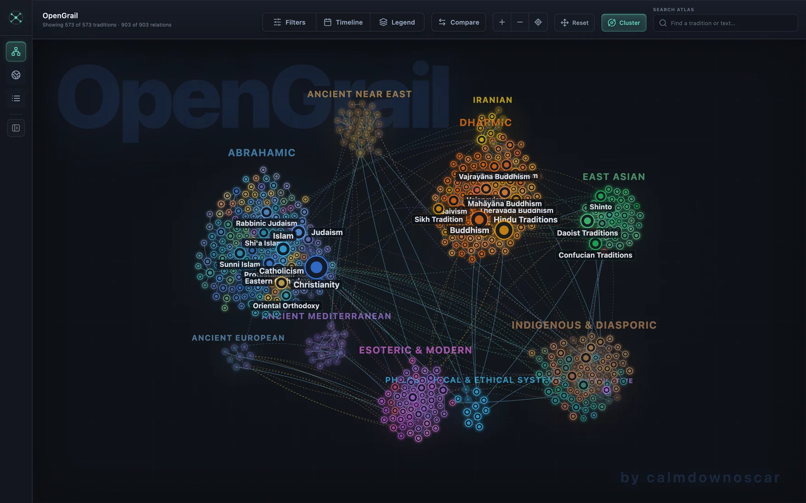
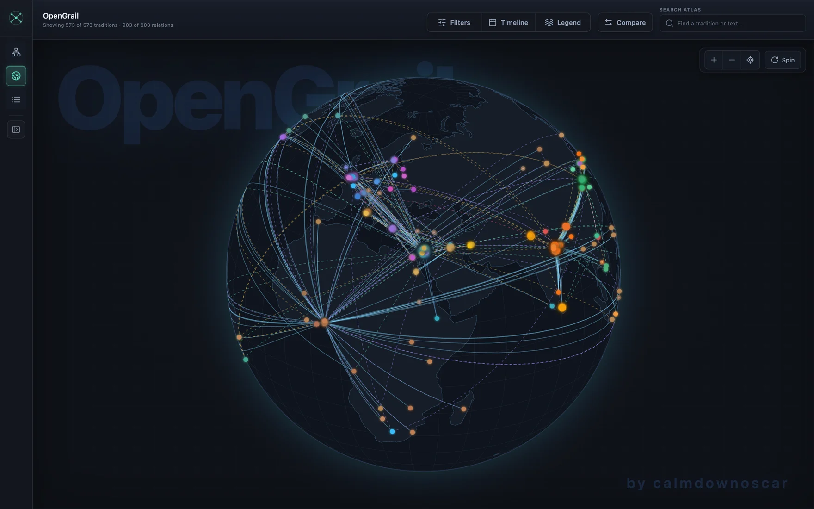

<div align="center">

# OpenGrail

**An interactive 3D atlas and force-graph mapping the genealogical tree, theological evolution, and cross-cultural links of world religions, mythologies, and ethical philosophies.**

[](https://github.com/CalixOscar/OpenGrail/actions/workflows/ci.yml)
[](LICENSE)
[](#content-model)
[](#content-model)
[](#content-model)
[](#content-model)
[](https://react.dev/)
[](https://www.typescriptlang.org/)
[](https://d3js.org/)

<h3>
  <a href="https://www.calmdownoscar.com/opengrail/">Live Interactive Atlas</a>
  <span> &middot; </span>
  <a href="#quick-start">Quick Start</a>
  <span> &middot; </span>
  <a href="CONTRIBUTING.md">Contribute a Tradition</a>
</h3>

<a href="https://www.calmdownoscar.com/opengrail/">
  
</a>

<sub>Force-graph view · <a href="https://www.calmdownoscar.com/opengrail/#view=map">the same data on the 3D globe</a></sub>

</div>

---

## Features

- **Force-Directed Conceptual Graph**: Dynamic physics engine visually clustering traditions by philosophical affinity, nested denominations, and cross-faith influences.
- **3D Interactive Orthographic Globe**: Geographic coordinate projection with great-circle relationship arcs tracking historical origins across continents and eras.

  

- **Chronological Timeline Scrubber**: Filter traditions and historical splits dynamically from ancient antiquity through modern movements.
- **Fuzzy Search & Deep Linking**: Instant keyboard search across traditions, aliases, and canonical texts. Every tradition and view mode has a unique, shareable URL hash (e.g. `#tradition=stoicism&view=map`).
- **Epistemic Rigor**: Explicitly distinguishes between `academic_consensus`, `minority_scholarly`, `theological_claim`, and `speculative_fringe` so historical facts and devotional traditions remain clear.
- **Curated Visual Artifacts**: Over 1,100 curated public-domain thumbnails and manuscripts linking out to high-resolution originals on Wikimedia Commons.
- **Markdown-as-Database**: 100% static, fast, and git-native. Every tradition is a standalone Markdown file with validated YAML frontmatter compiled deterministically into `graph.json`.

---

## Quick Start

### Prerequisites
- Node.js 18+
- npm

### Installation & Development

```bash
# Clone the repository
git clone https://github.com/CalixOscar/OpenGrail.git
cd OpenGrail

# Install dependencies
npm install

# Build graph data and launch local development server
npm run dev
```

Open [http://localhost:5173/opengrail/](http://localhost:5173/opengrail/) in your browser.

### Production Build

```bash
npm run build
npm run preview
```

---

## Content Model

Each file under `data/` serves as the single source of truth for one tradition. Frontmatter defines graph metadata, geographic coordinates, and outgoing lineage relations, while the Markdown body provides a scholarly summary.

```
data/
├── abrahamic/                  # Christianity, Judaism, Islam, Baha'i, Samaritans...
├── dharmic/                    # Hinduism, Buddhism, Jainism, Sikhism...
├── east-asian/                 # Daoism, Confucianism, Shinto, Mohism...
├── ancient-near-east/          # Mesopotamian, Egyptian, Canaanite...
├── ancient-mediterranean/      # Greco-Roman, Hellenistic mysteries, Gnosticism...
├── iranian/                    # Zoroastrianism, Manichaeism, Zurvanism...
├── african-traditions/         # Yoruba, Vodun, San, Dogon, Akan...
├── ancient-americas/           # Maya, Mexica (Aztec), Inka, Mississippian...
├── central-asian-siberian/     # Tengrism, Siberian Shamanism, Bön...
├── oceanic-australasian/       # Polynesian, Dreamtime, Māori, Micronesian...
├── indigenous-diasporic/       # Santería, Candomblé, Rastafari...
├── european-traditions/        # Celtic, Norse, Slavic, Baltic, Rodnovery...
├── philosophical-ethical/      # Stoicism, Neoplatonism, Humanism, Epicureanism...
├── esoteric-modern/            # Hermeticism, Theosophy, Anthroposophy...
└── speculative/                # Paleocontact, Proto-World reconstruction...
```

---

## Contributing

We welcome community contributions! Whether you want to add an obscure regional philosophy, refine historical dates, or fix relationship connections:

1. Read the [Contribution Guide](CONTRIBUTING.md).
2. Copy `data/_template.md` into the relevant `data/` subdirectory.
3. Validate locally with `npm run verify` (graph build, typecheck, and tests).
4. Open a Pull Request. Data changes need sources; the template asks for them.

Not ready to write a file? Open a [tradition proposal or a correction](https://github.com/CalixOscar/OpenGrail/issues/new/choose)
with your sources and it can be added for you. Broader questions about scope and
methodology belong in [Discussions](https://github.com/CalixOscar/OpenGrail/discussions).

Please also read the [Code of Conduct](CODE_OF_CONDUCT.md). Security issues go through the
[Security Policy](SECURITY.md), not the public issue tracker.

---

## Acknowledgements & Inspirations

- **[Simon E. Davies / Mythopia](https://www.youtube.com/@mythopia1)** — The foundational genealogical structure of the tradition tree was inspired by Simon Davies' pioneering visual research on *The Great Tree of Religion* (*Faithscape*). Support his work on [Patreon](https://www.patreon.com/Mythopia).
- **Wikimedia Commons** — Photographic and manuscript provenance for public-domain artifacts.
- **D3.js & React Force Graph** — Graph physics and geographic projections.

---

## License

The OpenGrail application codebase, authored data records under `data/`, and documentation are licensed under the [MIT License](LICENSE).

Third-party visual artifacts under `public/artifacts/` are individually licensed by their respective creators under open and public domain terms (Public Domain, CC0, CC-BY, CC-BY-SA). See [NOTICE.md](NOTICE.md) and [ATTRIBUTIONS.md](ATTRIBUTIONS.md) for complete licensing terms and per-file attributions.

